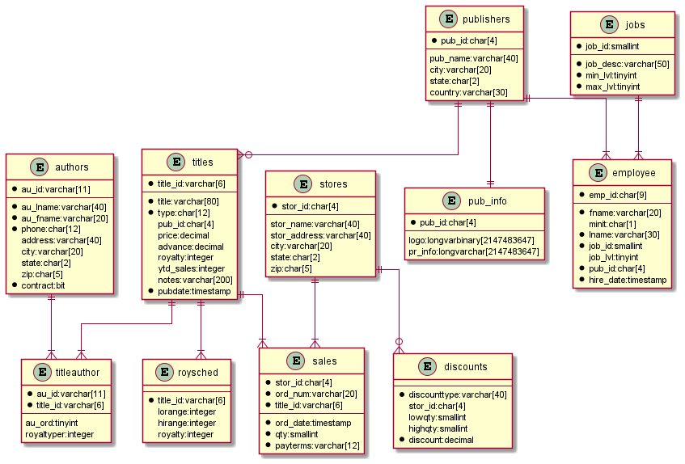
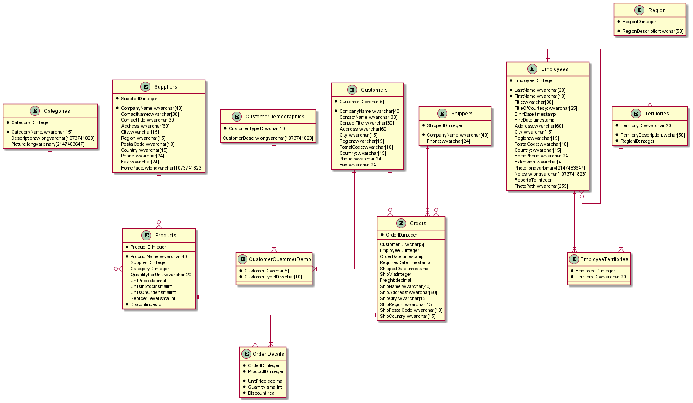
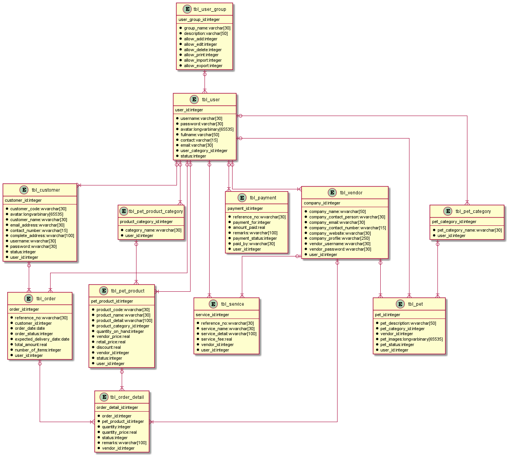

# Description

Convert MS SQL Schema to PlantUML diagram source using Python

# Usage

 python sql2puml.py OPTIONS
 
 |Switch|meaning|
 |--|--|
 |**Mandatory**||
 |-d, --database *database_name*|Name of database to get diagram for|
 | **Optional**||
 |-s, --schema *schema name*|Name of schema within the database.  Default `dbo` for SQL Server. Not required for MySQL|
 |-h, --host *server name*|Server to connect to. Default localhost|
 |-p, --port *port*|Port to connect to, default 1433|
 |-o, --out *output filename*|Filename to save output to. Default is write to console|
 |-S, --server *RDBMS*|RDBMS to use. Default of `mssql` or supply `mysql`|
 |-u, --user *user name*|User name to log in as. Omit to use trusted authentication with SQL Server|
 |-P, --password *password*|Password to log in with omit to use trusted authentication with SQL Server|
 |-D, --driver *ODBC Driver name*|ODBC Driver name to override in connection string Use `Get-OdbcDriver` in PowerShell to get full list of drivers on your system|
 |-z, --zerorows *mode*|mode= `show` to display empty tables as "greyed-out", `hide` to omit empty tables, retaining space, `remove` to omit empty tables and reclaim space|

**Example:** 

    Python sql2puml.py -server localhost -port 1433 -dbname pubs -schema dbo

# Output
## Pubs (SQL Server)

## Northwind (SQL Server)

## Petshop (MySQL)

# Install Issues
## M1 Mac, Mac OS X
* Follow [these homebrew instructions from MS](https://docs.microsoft.com/en-us/sql/connect/odbc/linux-mac/install-microsoft-odbc-driver-sql-server-macos?view=sql-server-ver16) to install the libraries, followed by the instructions in [this github comment](https://github.com/mkleehammer/pyodbc/issues/385#issuecomment-953105425) to install the `pyodbc` module.  Then use the `-D /opt/homebrew/lib/libmsodbcsql.17.dylib` flag on the cli.

# References
1. [PyODBC Cursor](https://github.com/mkleehammer/pyodbc/wiki/Cursor)
2. [MySQL ODBC Driver](https://dev.mysql.com/downloads/file/?id=501047)
