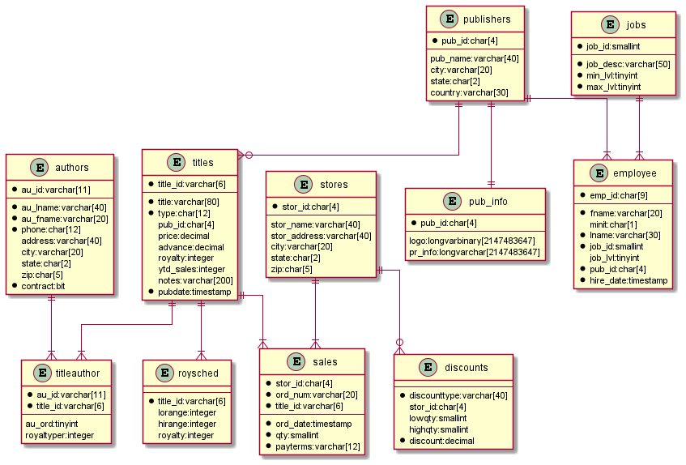
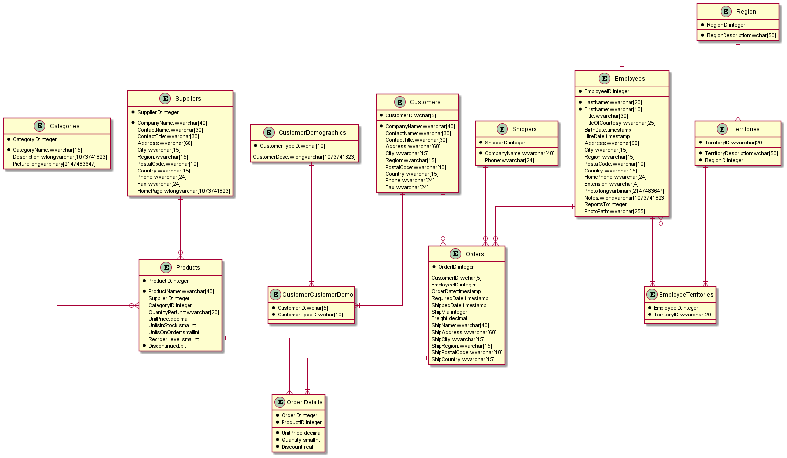

# Description

Convert MS SQL Schema to PlantUML diagram source using Python

# Usage

 python sql2puml.py OPTIONS
 
 |Switch|meaning|
 |--|--|
 |**Mandatory**||
 |-d, --database *database_name*|Name of database to get diagram for|
 | **Optional**||
 |-s, --schema *schema name*|Name of schema within the database, default dbo|
 |-h, --host *server name*|Server to connect to, default localhost|
 |-p, --port *port*|Port to connect to, default 1433|
 |-o, --out *output filename*|Filename to save output to, default is write to console|

**Example:** 

    Python sql2puml.py -server localhost -port 1433 -dbname pubs -schema dbo

# Output
## Pubs

## Northwind

# References
    https://github.com/mkleehammer/pyodbc/wiki/Cursor