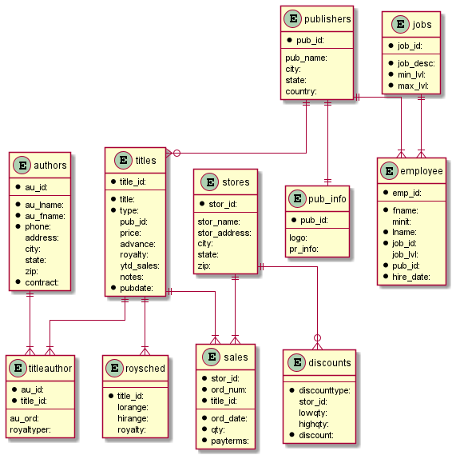

# sql2puml

Convert MS SQL Schema to PlantUML diagram source

Python version work in progress to address following TSQL limitations:

- Views are included. I should exclude those
- Composite keys aren't catered for well. e.g. on pubs, the Fk relationship from authors to titleauthors is identified as 1:1 where it should be 1:many. This is because the code isn't clever enough to see that au_id is part of a composite key (non unique) and not the whole key
- Portability between RDBMSs

## References
    https://github.com/mkleehammer/pyodbc/wiki/Cursor